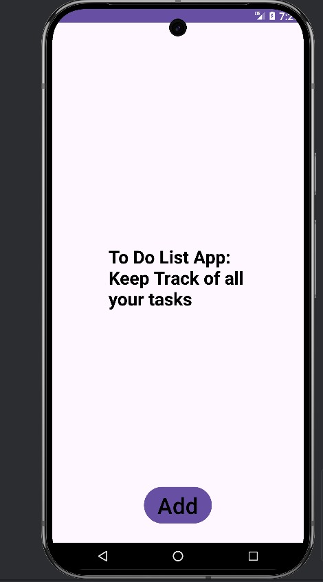
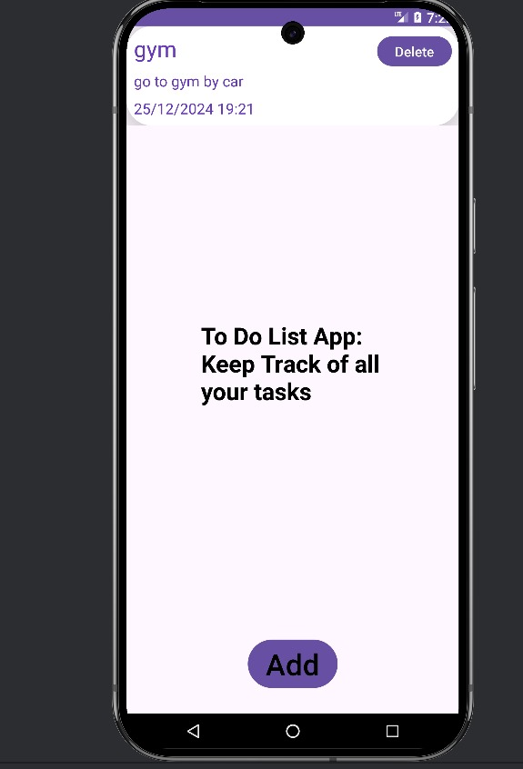
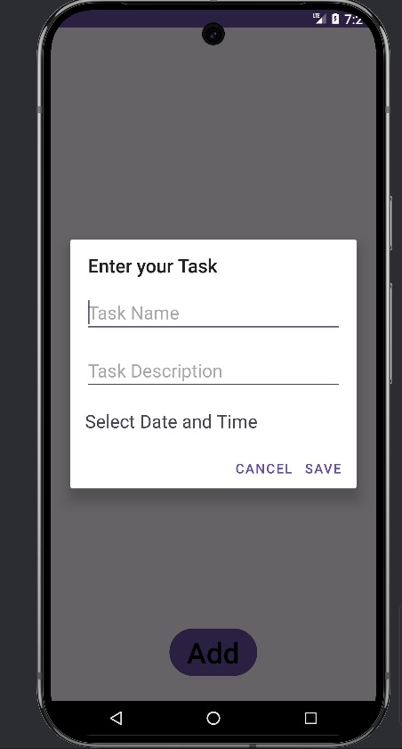
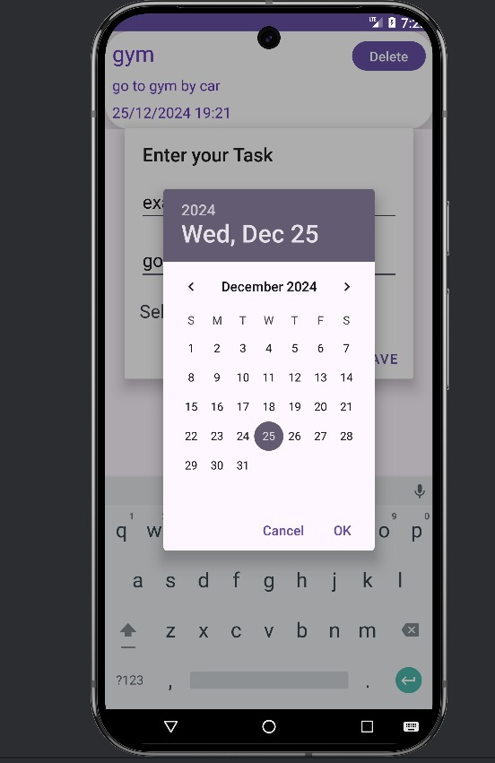
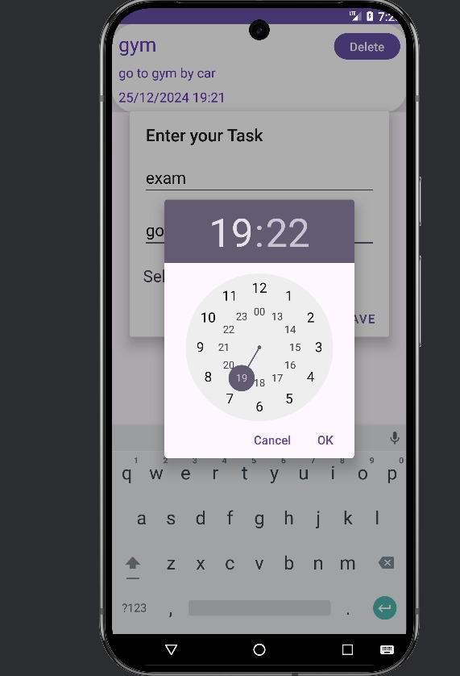
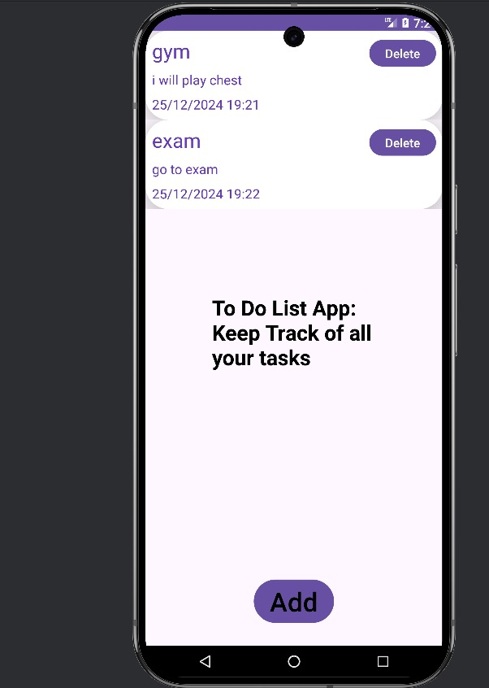

<h1 align="center">To-Do List App</h1>

This is a simple To-Do List application that helps users keep track of their tasks. Users can add tasks, view them with a timestamp, and delete them when completed.

---

## Features
- Add new tasks with descriptions.
- View all tasks in a neat list.
- Display timestamps for when tasks were added.
- Delete tasks after completion.
---

## Technology Stack
- **Frontend:** Android Jetpack Compose
- **Backend:** Local storage/database (e.g., Room or SharedPreferences, depending on implementation)

---

  
  
  
  
  
  

